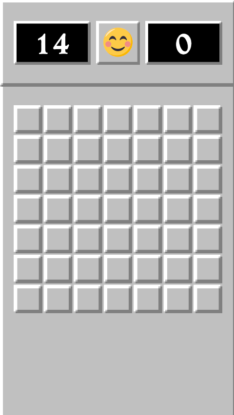

# Minesweeper (Test Assignment)

**Author:** Voloshanin Daniil  
**Engine:** Unity  
**Language:** C#  
**Architecture:** MVP + Dependency Injection (Zenject)

---

## 📌 About

This project is a **Minesweeper clone** implemented as a test assignment.

The goal was not only to recreate the classic gameplay, but also to demonstrate:

- clean and maintainable architecture
- clear separation of logic and UI
- usage of design patterns
- Dependency Injection
- scalability and extensibility

Visual style is inspired by the classic Minesweeper.

---

## 📷 Screenshots

### Gameplay


### Lobby (Board size & mines selection)


### HUD & Game State


---

## 🎮 Gameplay Features

- Configurable **board size** and **mine count**
- **First click is always safe**
- Left click / tap — open cell  
- Right click / long press — place flag
- Recursive opening of empty cells
- Win / Lose conditions
- Restart game at any moment
- Timer starts on **first player action**
- Flags counter and elapsed time
- Supports **PC and mobile input**

---

## 🧩 Architecture Overview

The project is built with **separation of concerns** in mind.

### Core Logic
- **BoardService**
  - Board generation
  - Mine placement
  - Cell opening logic (flood fill)
  - Win / lose conditions
- Contains no Unity-specific logic

### Presentation Layer
- **BoardPresenter**
  - Synchronizes board state with visual cells
- **GameFlowController**
  - Controls game lifecycle (start, restart, win, lose)
- **LobbySettingsPresenter**
  - Handles board size and mine count selection
- **GameOverPresenter**
  - Controls final game panel logic

### UI Layer
- UI components are **passive**
- No game logic inside UI MonoBehaviours
- UI communicates with logic only through events

---

## 🧪 Dependency Injection

- **Zenject** is used across the project
- `ProjectContext` — global services
- `SceneContext` — scene-specific bindings
- All dependencies are injected explicitly
- No hidden static dependencies

---

## 🌍 Localization

- Supported languages: **EN / RU**
- Localization format:
  ```json
  {
    "LanguageCode": "EN",
    "Data": [
      { "SID": "SID_YOU_WIN", "LString": "YOU WIN!" }
    ]
  }
